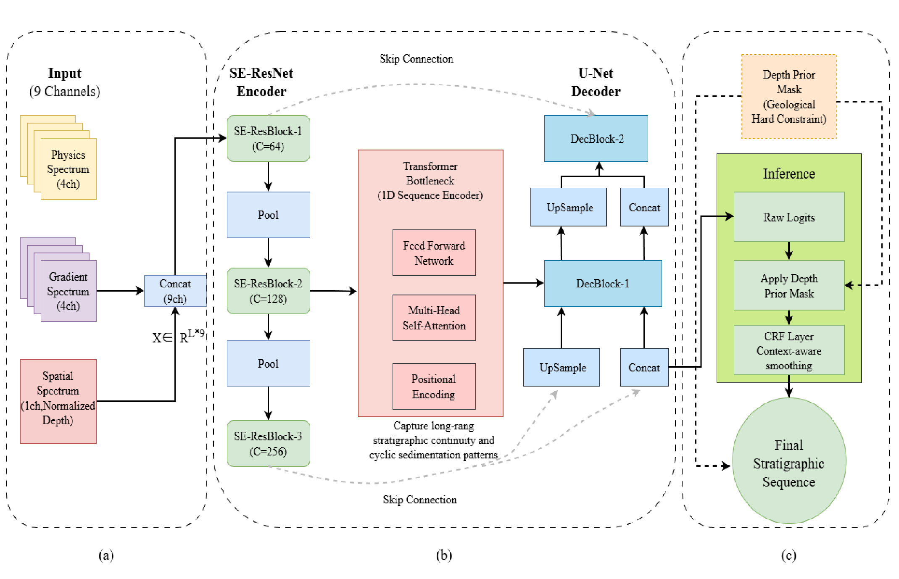

# DA-TransResUNet: Depth-Aware Transformer-Residual Network for Stratigraphic Correlation

[](https://www.python.org/)
[](https://pytorch.org/)
[](https://opensource.org/licenses/MIT)

---

## 📌 Overview

This repository provides the official PyTorch implementation of the paper:

**"Depth-Aware Transformer-Residual Network for Automatic Stratigraphic Correlation from Well Logs"**

Stratigraphic correlation is a fundamental task in subsurface modeling. However, it remains challenging in continental basins due to:

- Lithological homonymy caused by cyclic sedimentation
- Non-stationary noise in deep well sections
- Increased complexity in fine-grained multi-class stratification

To address these challenges, we propose **DA-TransResUNet**, a depth-aware hybrid CNN-Transformer model that integrates:

- Explicit depth encoding (geological prior)
- SE-ResNet for local feature extraction
- Transformer for long-range dependency modeling
- CRF-based depth constraint for physically consistent predictions

The model achieves:

- **F1-score: 0.9851** (cross-validation)
- **F1-score: 0.982** (blind test wells)

on an industrial dataset with 1170 wells.

---

## ✨ Key Features

- **Depth-aware constraint** to reduce cross-layer misclassification  
- **Hybrid CNN-Transformer architecture** for multi-scale feature learning  
- **Robust performance** in fine-grained (16-class) stratigraphic tasks  
- **Noise-resistant design** for deep well environments  

---

## 🏗️ Model Architecture

<p align="center">
  
</p>

---

## ⚙️ Installation

Clone the repository:

```bash
git clone https://github.com/zgzwd213-hub/DA-TransResUNet.git
cd DA-TransResUNet
```
---

## Dataset

Due to confidentiality agreements, the full industrial dataset (1170 wells) used in this study cannot be publicly released.

A sample dataset is provided for demonstration and reproducibility:
data/sample_data.csv


### Sample Data Description

The dataset includes:

- **GR** – Gamma Ray  
- **AC** – Acoustic transit time  
- **DEN** – Density  
- **RLLD** – Deep resistivity  
- **Label** – Stratigraphic unit index  

This dataset is intended for testing code functionality only.

---

## Quick Test (Required for Reproducibility)

To run a quick demonstration:

```bash
python examples/quick_test.py
```
This script will:

Load the sample well log dataset
Construct 9-channel input features, including gradients and normalized depth
Encode stratigraphic labels from the LAYER column
Run a lightweight demo inference
Print prediction results and basic statistics

Note: this script is a functional demonstration of the workflow described in the paper. It does not reproduce the full DA-TransResUNet model training because the full industrial dataset and trained weights are not publicly available.

## Training

To train the model:
```bash
python train/train.py
```
## Inference

To perform prediction:

Code Availability

The implementation of DA-TransResUNet is publicly available in this repository and can be freely accessed for research purposes.

## Notes
The full industrial dataset is not publicly available
Sample data is provided for demonstration only
This repository is designed to meet journal requirements for code availability
